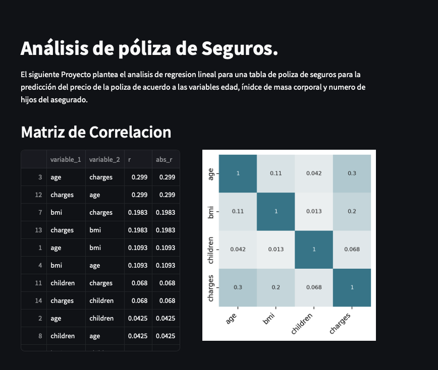

## Para correr proyecto:

#### Clonar el proyecto:
```python
git clone https://github.com/....

```

#### Ir a la carpeta del proyecto

```
cd sss
```

#### crear un entorno virtual
```
python -m venv env
```

#### Activar el entorno virtual
Para windows:
```
.\env\bin\scripts\activate
```

Para mac:
```
source env\bin\activate
```

#### Instalar todas las dependencias:
```
pip install -r requirements.txt
```


#### Ejecutar el proyecto mediante streamlit
```
streamlit run proyecto-01.py
```

Se abrirá una pagina en un navegador con el despliegue del proyecto.


